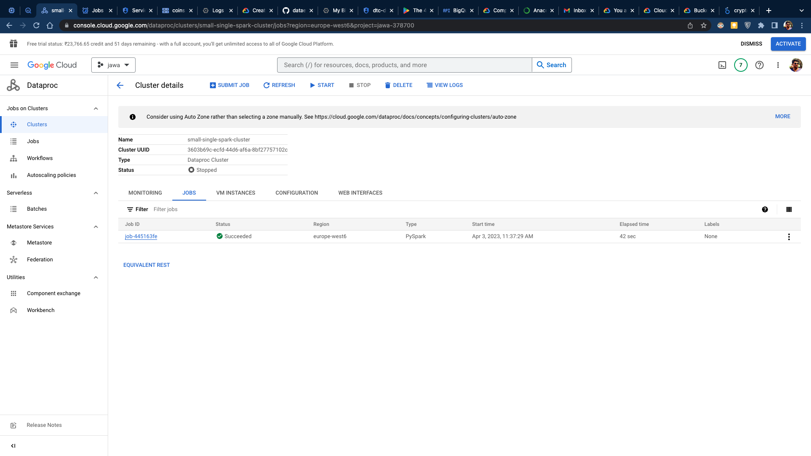
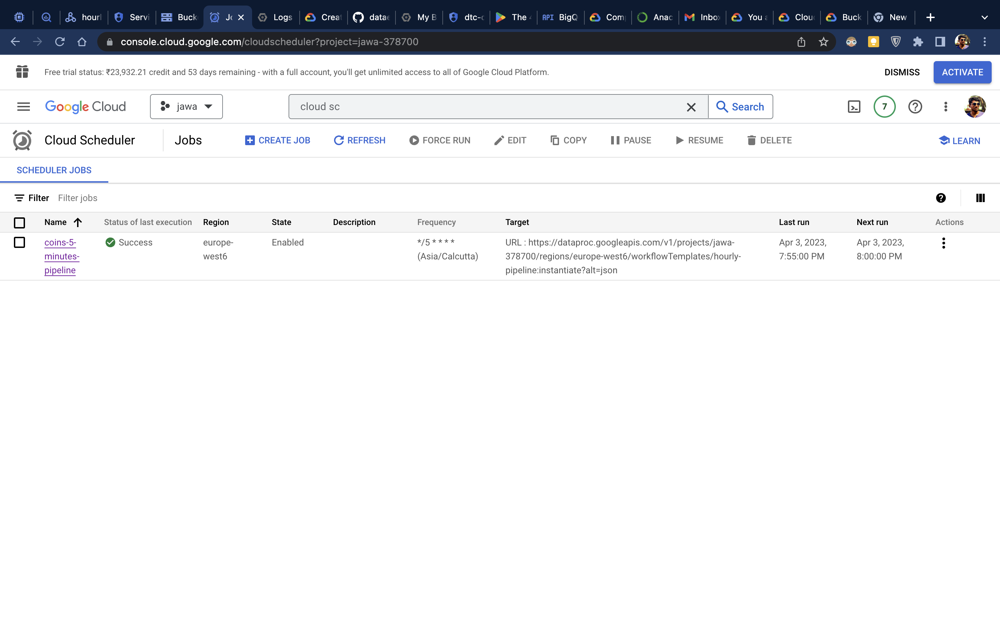

# PySpark Data Transformation on Dataproc

Created a single-node Dataproc cluster to run the `transformation.py` PySpark notebook, as well as setting up a workflow template for a PySpark job type that launches a workflow running a DAG. The project also schedules the job to run every 5 minutes using the Google Cloud Scheduler.

## Usage

Running PySpark on Dataproc and scheduling involves three main components.:

1. A single-node Dataproc cluster to run the PySpark notebook `transformation.py`, which contains data transformation logic.
   this blog should certainly help - [How to Use Google Dataproc](https://www.freecodecamp.org/news/what-is-google-dataproc/)

   
2. A workflow template for PySpark job type that launches a workflow running a Directed Acyclic Graph (DAG) to execute tasks in a specific order.
3. A scheduled job that runs every 5 minutes using Google Cloud Scheduler. [Workflow using Cloud Scheduler](https://cloud.google.com/dataproc/docs/tutorials/workflow-scheduler) this link should help

   
