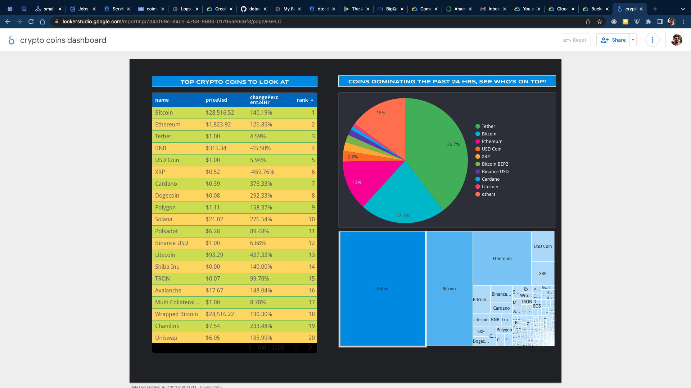

# Crypto Coins Dashboard

I've built the crypto coins dashboard using Looker Studio. The dashboard pulls data from a `coins.csv` file stored in the `coins_data_gold` Google Cloud Storage bucket.

The crypto coins dashboard consists of two main features:

1. A dynamic display of the top coins, with new results updated every 5 minutes during the pipeline run.
2. A historical view of the top 10 coins that dominated the market in the past 24 hours.

link to the dashboard - [crypto coins dashboard](https://lookerstudio.google.com/reporting/7343f69c-84ce-4768-8690-01795ae0c6f3/page/F6FLD)

