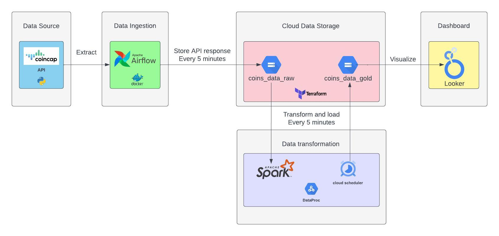

# CoinsDashboard: Near-Real-Time Cryptocurrency Analytics

CryptoDashboard is a dynamic, user-friendly, and visually engaging dashboard that consolidates and displays real-time and historical performance data of 1000+ cryptocurrencies based on their rank. It is designed to enable users to make informed decisions and better understand the trends in the cryptocurrency market.

## Table of Contents

* [Problem Statement](https://chat.openai.com/chat?model=gpt-4#problem-statement)
* [Data Architecture](https://chat.openai.com/chat?model=gpt-4#data-architecture)
* [Data Ingestion](https://chat.openai.com/chat?model=gpt-4#data-ingestion)
* [Cloud Data Storage](https://chat.openai.com/chat?model=gpt-4#cloud-data-storage)
* [Transformations](https://chat.openai.com/chat?model=gpt-4#transformations)
* [Data Warehouse](https://chat.openai.com/chat?model=gpt-4#data-warehouse)
* [Scheduling the Workflow](https://chat.openai.com/chat?model=gpt-4#scheduling-the-workflow)
* [Dashboard](https://chat.openai.com/chat?model=gpt-4#dashboard)
* [Directory Structure](https://chat.openai.com/chat?model=gpt-4#directory-structure)

## Problem Statement

The limited availability of comprehensive and easily accessible information on the dynamic and rapidly evolving cryptocurrency market hinders the ability of investors, traders, and market analysts to make informed decisions, leading to inefficiencies and missed opportunities for growth and profit. This problem statement is important to address 1) Hindered decision-making, 2) Lack of market transparency, 3) Barrier to entry.

As initial attempt, the proposed problem statement for this project is to develop a dynamic, user-friendly, and visually engaging dashboard that consolidates and displays real-time and historical performance data of 1000+ cryptocurrencies based on their rank. The dashboard will include the USD price of each cryptocurrency as well as the percentage change in price compared to the previous 24 hours. The dashboard should update every 5 minutes during the pipeline run and offer a historical view of the top 10 coins that dominated the market in the past 24 hours, thereby enabling users to make informed decisions and better understand the trends in the cryptocurrency market.

## Data Architecture



## Data Ingestion

CoinCap is a tool that provides real-time prices and market activity for over 1,000+ cryptocurrencies. It collects exchange data from thousands of markets to offer accurate data on asset price and availability. This project uses the free CoinCap API for data ingestion.

### Efficient Data Ingestion with Airflow Orchestration

Airflow is an open-source platform used to author, schedule, and monitor workflows. Running Airflow on a Docker container provides an isolated and reproducible environment for running workflows. The containerized version of Airflow allows for easy deployment and scaling of the platform. The Airflow DAG is set to run every 5 minutes and partitions and stores the data as raw JSON based on timestamp.

[View the Airflow Orchestration](https://github.com/Jawakar/coins_dashboard/tree/main/airflow)

## Cloud Data Storage

Terraform is an open-source infrastructure-as-code (IAC) tool, utilized to construct, manage, and version infrastructure across multiple cloud providers. It allows for the easy provisioning and management of resources. This project leverages Terraform to efficiently create and maintain GCP storage (GCS) buckets.

[View the Terraform Configuration](https://github.com/Jawakar/coins_dashboard/tree/main/terraform)

## Transformations

PySpark is a Python-based open-source distributed computing framework used for large-scale data processing. It is utilized in this project to transform raw data, such as JSON, into meaningful rows and columns using its powerful data processing capabilities, including data cleaning, transformation, and aggregation. All of this is done in Dataproc.

[View the PySpark Transformations](https://github.com/Jawakar/coins_dashboard/tree/main/spark_transformations)

## Data Warehouse

BigQuery is a cloud-based data warehouse solution that facilitates high-speed querying and analysis of large datasets. It offers a user-friendly interface that simplifies the loading of data from various sources. This project leverages BigQuery to import and convert CSV files to tables, enabling efficient analytical processing.

Data Warehouse: `jawa-378700.coins_data.coins_gold_table`

## Scheduling the Workflow

Dataproc is a cloud-based managed service offered by Google Cloud Platform (GCP) that provides a fully managed Apache Hadoop, Spark, and Hive cluster. Dataproc cluster is used to run the PySpark transformations in this project. Cloud Scheduler is another cloud-based service provided by GCP that allows for the scheduling of jobs or tasks, including running pipelines or workflows. This project uses Cloud Scheduler to

This project uses Cloud Scheduler to schedule the job every 5 minutes.

[View the Cloud Scheduler Configuration](https://github.com/Jawakar/coins_dashboard/tree/main/DataProc)

## Dashboard

Looker Studio is a cloud-based business intelligence and data analytics platform used for visualizing the useful insights.

**Link to the dashboard:** [https://lookerstudio.google.com/reporting/7343f69c-84ce-4768-8690-01795ae0c6f3/page/F6FLD](https://lookerstudio.google.com/reporting/7343f69c-84ce-4768-8690-01795ae0c6f3/page/F6FLD)

[View the Looker Studio Dashboard Configuration](https://github.com/Jawakar/coins_dashboard/tree/main/dashboard)

## Installation and Setup

Before running this project, you'll need to install the required Python packages listed in the `requirements.txt` file.

### Prerequisites

* Python 3.6 or higher
* Google Cloud SDK

### Installing Dependencies

To install the dependencies, navigate to the project's root directory and run the following command:

`pip install -r requirements.txt `


### Configuring Google Cloud SDK

Make sure you have the Google Cloud SDK installed and configured with the necessary credentials. Follow the [official Google Cloud SDK documentation](https://cloud.google.com/sdk/docs/install) for installation and configuration instructions.

After installing the dependencies and configuring the Google Cloud SDK, you can proceed to run the project according to the instructions provided in the respective component directories.

## Directory Structure

Below is an overview of the project's directory structure:

```
CryptoDashboard/
│
├── data-architecture/
│   └── ETL-architecture.jpeg
│
├── terraform/
│   ├── gcp_bucket.tf
│   ├── readme.md
│   ├── terraform.tfstate
│   ├── terraform.tfstate.backup
│   ├── terraform.tfvars
│   ├── terraform_setup.md
│   └── variable.tf
│
├── airflow/
│   ├── DAG.png
│   ├── airflow.cfg
│   ├── dags/
│   │   └── ingest_data.py
│   ├── docker-compose.yml
│   ├── dockerfile
│   ├── ingest_data_task.png
│   ├── logs/
│   │   └── scheduler/
│   │       ├── 2023-04-01/
│   │       └── latest -> /opt/airflow/logs/scheduler/2023-04-01
│   ├── plugins/
│   ├── readme.md
│   ├── requirements.txt
│   └── scripts/
│       └── entrypoint.sh
│
├── spark-transformations/
│   ├── coins.csv
│   ├── lib/
│   │   └── gcs-connector-hadoop3-2.2.5.jar
│   ├── readme.md
│   └── transformations.py
│
├── DataProc/
│   ├── cloud-scheduler.png
│   ├── image/
│   │   └── readme/
│   │       ├── 1680703739950.png
│   │       └── 1680703833084.png
│   ├── readme.md
│   └── small-single-spark-cluster.png
│
├── dashboard/
│   ├── crypto_coins_dashboard.png
│   ├── image/
│   │   └── readme/
│   │       └── 1680705093883.png
│   └── readme.md
│
├── requirements.txt
│
└── README.md

```


This structure includes the data architecture diagram, Terraform configuration, Airflow orchestration, PySpark transformations, DataProc components, dashboard configuration, requirements file, and this README file.

Please refer to the individual folders for more detailed information on each component.
